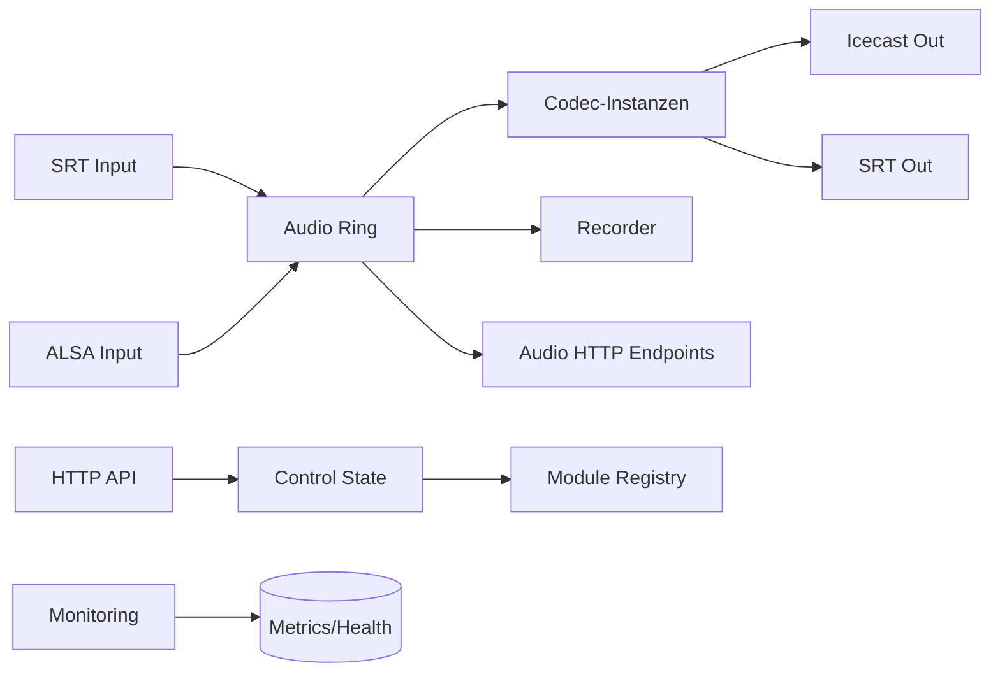

# Airlift Node

Airlift Node ist ein Audio-Node, der kontinuierliche PCM-Audioframes annimmt,
über eine Ringpuffer-Pipeline verarbeitet und als Streams, Dateien oder HTTP-
Endpunkte bereitstellt. Das System bringt eine modulare Codec-Schicht,
Monitoring sowie eine Steuer- und Status-API mit.

## Aufgaben

- **Audioeingang**: SRT- und ALSA-Quellen in den gemeinsamen Ringpuffer führen.
- **Verarbeitung**: Codec-Instanzen auf feste PCM-Frames anwenden.
- **Ausgabe**: Icecast/SRT-Streams, Recorder (WAV/MP3) und Audio-HTTP-Endpoints.
- **Betrieb**: Status/Steuerung via API, Monitoring über Metrics & Health.

## Zentrale Bausteine

- **Ring** (`src/ring`): geteilte Audio-Drehscheibe mit Puffer- und Statistiklogik.
- **Codecs** (`src/codecs`): Instanzbasierte Encoder mit eigener Konfiguration.
- **I/O** (`src/io`): Eingänge (SRT/ALSA) und Ausgänge (Icecast/SRT).
- **Recorder** (`src/recorder`): WAV/MP3-Aufzeichnung und Retention.
- **API/Web** (`src/api`, `src/web`): Status, Steuerung, Peaks & History.
- **Services** (`src/services`): API-, Audio-HTTP- und Monitoring-Server.

## Datenfluss (vereinfacht)



## Einstiegspunkte

- **Bootstrap & Runtime**: `src/main.rs`, `src/bootstrap.rs`
- **Konfiguration**: `src/config.rs` (TOML)
- **Module-Registry**: `src/api/registry.rs`

## Konfiguration

Die Konfiguration erfolgt über eine TOML-Datei (Default: `config.toml`). Beim
Start kann eine alternative Datei als erstes Argument übergeben werden:

```
airlift-node ./config.vps.toml
```

## Begriffe: Inputs, Outputs, Services

Die Graph-Pipeline beschreibt den Datenfluss über **Inputs**, **Outputs** und
**Services**. Die IDs der Einträge (`[inputs.<id>]`, `[outputs.<id>]`,
`[services.<id>]`) sind frei wählbar und werden in Referenzen genutzt.

- **Input**: Quelle, die Audioframes in einen Ringbuffer schreibt.
  - Beispiel: `type = "srt"` mit `listen` + `latency_ms`, oder
    `type = "http_stream"` mit `url`.
- **Output**: Ziel, das Audioframes aus einem Input (und damit aus dem gleichen
  Ringbuffer) konsumiert und über einen Codec ausgibt.
  - Beispiel: `type = "icecast_out"` mit `codec_id = "opus_ogg"`.
- **Service**: Hilfsdienste (Monitoring, Audio-HTTP, Peak-Analyzer), die den
  Ringbuffer oder den Input lesen, aber keine Audio-Ausgabe erzeugen.
  - Beispiel: `type = "monitoring"` oder `type = "audio_http"`.

## IO-Typen-Katalog (Inputs/Outputs/Services)

Ableitbar aus `InputConfig`, `OutputConfig`, `ServiceConfig` in
`src/config.rs`. Pflichtfelder gelten zusätzlich zu `type` und `enabled`.

### Inputs

- **`srt`**: `buffer`, `listen`, `latency_ms` (`streamid` optional)
- **`icecast` / `http_stream`**: `buffer`, `url`
- **`alsa`**: `buffer`, `device`

### Outputs

Jeder Output benötigt **immer**: `input`, `buffer`, `codec_id`.

- **`srt_out`**: `target`, `latency_ms`
- **`icecast_out`**: `host`, `port`, `mount`, `user`, `password`, `name`,
  `description`, `genre`, `public`, `bitrate`
- **`udp_out`**: `target`
- **`recorder`**: `wav_dir`, `retention_days`

### Services

- **`audio_http`**: `buffer`, `codec_id`
- **`monitoring`**: keine zusätzlichen Pflichtfelder
- **`peak_analyzer`**: `buffer`, `interval_ms`
- **`influx_out`**: `url`, `db`, `interval_ms`
- **`broadcast_http`**: `url`, `interval_ms`

## Verbindliche Strukturregeln

1. **Input → Ringbuffer**: Jeder Input muss einen `buffer` referenzieren.
2. **Output → Input → Ringbuffer**: Jeder Output muss `input` setzen und
   denselben `buffer` wie der referenzierte Input nutzen.
3. **Codec-Pflicht**: Jeder Output benötigt `codec_id`.
4. **Services**: Services referenzieren entweder `buffer` oder `input`; wenn
   beides gesetzt ist, müssen Buffer und Input zueinander passen.

## Legacy-Mapping & Übergangsphase

Neben der Graph-Pipeline existieren Legacy-Felder auf Root-Ebene. Sobald
`ringbuffers`, `inputs`, `outputs` oder `services` gesetzt sind, wird **nur**
die Graph-Pipeline verwendet (Legacy-Felder werden ignoriert). Für die
Übergangsphase gilt:

- **`srt_in` → `inputs.*`** mit `type = "srt"`
- **`alsa_in` → `inputs.*`** mit `type = "alsa"`
- **`icecast`/`http_stream` Input → `inputs.*`** mit `type = "icecast"` bzw.
  `type = "http_stream"`
- **`srt_out` → `outputs.*`** mit `type = "srt_out"`
- **`icecast_out` → `outputs.*`** mit `type = "icecast_out"`
- **`udp_out` → `outputs.*`** mit `type = "udp_out"`
- **`recorder` → `outputs.*`** mit `type = "recorder"`
- **`audio_http_codec_id` → `services.*`** mit `type = "audio_http"` +
  `codec_id`

Empfehlung: neue Setups vollständig in der Graph-Pipeline pflegen und Legacy-
Felder schrittweise entfernen.

## Mehrere Outputs pro Typ (z. B. `icecast_out` mehrfach)

Die Graph-Pipeline erlaubt mehrere Outputs desselben Typs, solange jede
Konfiguration eine eigene ID besitzt (z. B. `[outputs.icecast_main]` und
`[outputs.icecast_backup]`).

### Beispielkonfiguration

Die Datei `config.sample.toml` ist eine kommentierte Referenz für die aktuelle
Graph-Pipeline. Wichtige Punkte:

- **Graph aktivieren**: Sobald `ringbuffers`, `inputs`, `outputs` oder
  `services` gesetzt sind, wird die Graph-Pipeline genutzt.
- **Genau ein Ringbuffer & ein Input**: Aktuell ist genau ein Ringbuffer und
  genau ein Input-Typ erlaubt.
- **Input-Typen**:
  - `srt` (Listener, benötigt `listen` + `latency_ms`)
  - `http_stream`/`icecast` (benötigt `url`, erwartet Ogg/Opus)
- **Buffer-Verknüpfung**: `buffer` muss exakt der Ringbuffer-ID entsprechen
  (im Sample: `main`).
- **Codecs**: Jeder Output benötigt ein `codec_id`, das in `[codecs.*]`
  definiert ist.

### VPS-Konfiguration (Icecast)

Die Datei `config.vps.toml` ist für den Betrieb mit dem RFM-Icecast-Stream
vorbereitet (`https://icecast.radiorfm.de/rfm.ogg`, 96 kbit/s Opus). Sie kann
die lokale `config.toml` ersetzen oder direkt beim Start angegeben werden.
