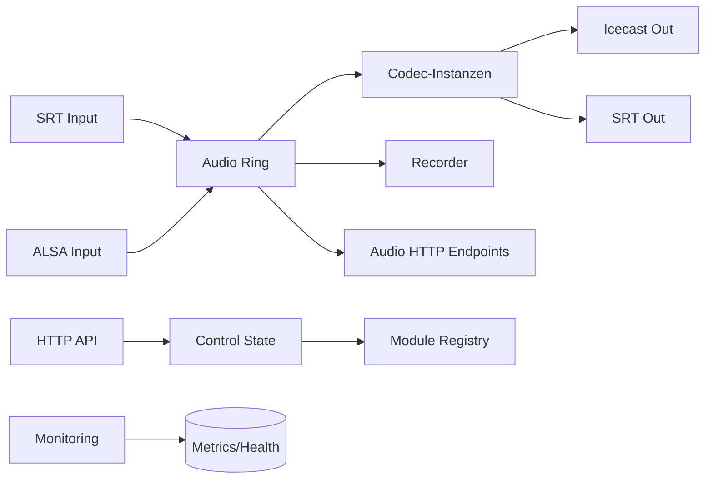

# Airlift Node

Airlift Node ist ein Audio-Node, der kontinuierliche PCM-Audioframes annimmt,
über eine Ringpuffer-Pipeline verarbeitet und als Streams, Dateien oder HTTP-
Endpunkte bereitstellt. Das System bringt eine modulare Codec-Schicht,
Monitoring sowie eine Steuer- und Status-API mit.

## Aufgaben

- **Audioeingang**: SRT- und ALSA-Quellen in den gemeinsamen Ringpuffer führen.
- **Verarbeitung**: Codec-Instanzen auf feste PCM-Frames anwenden.
- **Ausgabe**: Icecast/SRT-Streams, Recorder (WAV/MP3) und Audio-HTTP-Endpoints.
- **Betrieb**: Status/Steuerung via API, Monitoring über Metrics & Health.

## Zentrale Bausteine

- **Ring** (`src/ring`): geteilte Audio-Drehscheibe mit Puffer- und Statistiklogik.
- **Codecs** (`src/codecs`): Instanzbasierte Encoder mit eigener Konfiguration.
- **I/O** (`src/io`): Eingänge (SRT/ALSA) und Ausgänge (Icecast/SRT).
- **Recorder** (`src/recorder`): WAV/MP3-Aufzeichnung und Retention.
- **API/Web** (`src/api`, `src/web`): Status, Steuerung, Peaks & History.
- **Services** (`src/services`): API-, Audio-HTTP- und Monitoring-Server.

## Datenfluss (vereinfacht)

## Einstiegspunkte

- **Bootstrap & Runtime**: `src/main.rs`, `src/bootstrap.rs`
- **Konfiguration**: `src/config.rs` (TOML)
- **Module-Registry**: `src/api/registry.rs`
