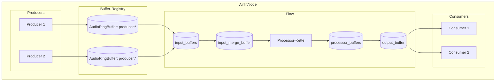

# Architektur

Dieses Dokument beschreibt die aktuelle Pipeline in Airlift Node und ihre
Komponenten (AirliftNode → Flow → Producer/Processor/Consumer) sowie den
Datenfluss, den Buffer-Lifecycle und das Threading-Modell. Die maßgeblichen
Implementierungen befinden sich in:

- `src/core/node.rs` (AirliftNode/Flow)
- `src/core/ringbuffer.rs` (AudioRingBuffer)
- `src/processors/*` (Processor-Implementierungen)

## Überblick: Pipeline und Komponenten

**AirliftNode** verwaltet Producer, Flows und die Buffer-Registry. Ein Flow
ist eine eigenständige Verarbeitungskette, die mehrere Inputs zusammenführt,
Processor-Schritte ausführt und den Output an Consumer weiterreicht.

- **AirliftNode** (`src/core/node.rs`): Orchestriert die Pipeline, verwaltet
  Producer/Flows und startet/stoppt sie.
- **Flow** (`src/core/node.rs`): Besitzt Input-/Merge-/Processor-/Output-Buffer
  und eine Processor-Kette.
- **Producer**: Schreiben Frames in Ringbuffer, die in der Registry des Nodes
  geführt werden.
- **Processor** (`src/processors/*`): Transformieren den Audiostream (z. B.
  PassThrough, Gain, Mixer) und arbeiten bufferbasiert.
- **Consumer**: Lesen aus dem Flow-Output-Buffer und exportieren die Daten.

## Datenfluss-Diagramm

### Buffer-Lifecycle (vereinfacht)

1. **Producer** erzeugt PCM-Frames und schreibt sie in einen zugeordneten
   `AudioRingBuffer` (über die Buffer-Registry referenziert).
2. **Flow** liest aus allen `input_buffers` und schreibt die Frames in den
   `input_merge_buffer`.
3. **Processor-Kette** verarbeitet den Stream schrittweise:
   - Jeder Processor liest aus dem vorherigen Buffer.
   - Das Ergebnis wird in den nächsten `processor_buffers` geschrieben.
4. **Output**: Der letzte Processor schreibt in den `output_buffer`.
5. **Consumer** lesen aus dem `output_buffer` (multi-reader-fähig über
   `pop_for_reader` in `src/core/ringbuffer.rs`).
6. **Ringbuffer-Verhalten**: Der Buffer überschreibt bei Volllauf ältere
   Frames; `dropped_frames` steigt, wenn Sequenzen nicht mehr verfügbar sind.

## Threading-Modell

- **AirliftNode**: Startet/stopt Producer und Flows zentral (`src/core/node.rs`).
- **Flow**: Jeder Flow startet einen eigenen Processing-Thread
  (`Flow::start → processing_loop`). Dieser Thread:
  - sammelt Frames aus `input_buffers`,
  - befüllt den `input_merge_buffer`,
  - iteriert über die Processor-Kette,
  - schreibt in `output_buffer`.
- **Producer/Consumer**: Werden vom Node gestartet/gestoppt. Viele
  Implementierungen nutzen eigene Threads oder IO-Callbacks; das genaue
  Modell ist abhängig von der jeweiligen Implementierung in
  `src/producers/*` bzw. `src/core/consumer/*`.

## Relevante Module

- `src/core/node.rs` — Orchestrierung von AirliftNode/Flow und Pipeline-Logik.
- `src/core/ringbuffer.rs` — AudioRingBuffer mit Multi-Reader-Logik,
  Sequenz-Tracking und Drop-Handling.
- `src/processors/*` — Konkrete Processor-Implementierungen.
